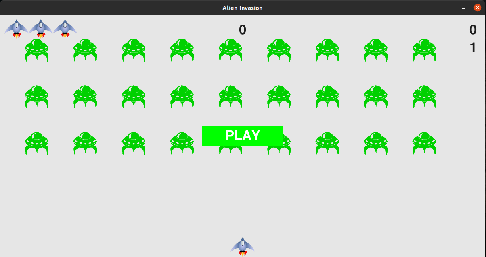

# :space_invader: Alien Invasion
**Alien Invasion** is a clone of the popular arcade game ***Space Invaders***.
I created this game by following the [Python Crash Course](https://www.amazon.in/Python-Crash-Course-Eric-Matthes/dp/1593279280) book.                               
The reason was to improve my **PYTHON** skills.

<div align = center margin = auto>
    
</div>

##  :alien: Introduction
> In Alien Invasion, the player controls a ship that appears at
the bottom center of the screen. The player can move the ship
left and right using the arrow keys and shoot bullets using the
spacebar. When the game begins, a fleet of aliens fills the sky
and moves across and down the screen. The player shoots and
destroys the aliens. If the player shoots all the aliens, a new fleet
appears that moves faster than the previous fleet. If any alien hits
the player’s ship or reaches the bottom of the screen, the player
loses a ship. The player gets 3 extra ships. If the player 
loses all four ships, the game ends.


## :video_game: Controls
- Spacebar :- To shoot.
- Left and right arrow keys :- To move the ship left and right.


## :rocket: Let's Play
### Cloning the Repository
```
$ git clone https://github.com/Blaze-K8/alien_invasion.git 
$ cd alien_invasion
```
### Activating the virtual environment

#### In Linux/Mac terminal :-
```
$ source venv/bin/activate
```

#### In Windows CMD :- 
```
$ win\Scripts\activate
```

### Running the game
```
$ python alien_invasion.py
```

### Deactivating the virtual environment
```
$ deactivate
```

Enjoy the game.:smile:
